## Hi there 👋

<!--
**fuzy112/fuzy112** is a ✨ _special_ ✨ repository because its `README.md` (this file) appears on your GitHub profile.

Here are some ideas to get you started:

- 🔭 I’m currently working on ...
- 🌱 I’m currently learning ...
- 👯 I’m looking to collaborate on ...
- 🤔 I’m looking for help with ...
- 💬 Ask me about ...
- 📫 How to reach me: ...
- 😄 Pronouns: ...
- ⚡ Fun fact: ...
-->

- 🔭 I’m currently working on Linux desktop software
- 🌱 I’m currently learning **Rust**, **Common Lisp**, **Scheme**
- 💬 Ask me about **Emacs**, **NixOS**, **C/C++**, **GNU/Linux**
- 📫 How to reach me: **i@fuzy.me**
- 😄 Pronouns: **he/him**
- ⚡ Fun fact: **I use Emacs for everything and I'm not sorry about it**

### 📊 Stats

